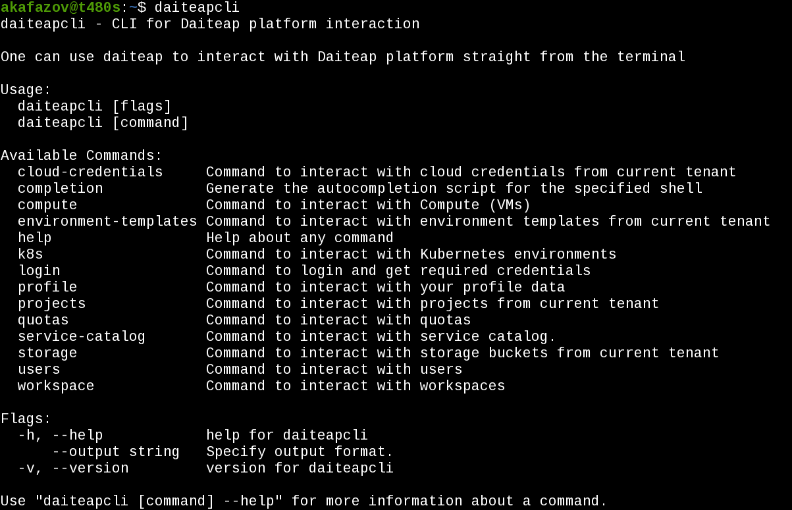

# daiteapcli

Reduce Complexity with automated setup of Kubernetes Cluster, Virtual Machines and Storage across Provider and Platforms.

- Website: https://daiteap.com



----

The `daiteapcli` is a command line tool that you can use alternatively to oru Daiteap Platform to interact with a Cloud Provider.

daiteapcli offers one interface to IaaS cloud provider and cloud platforms to spin up essential services. With our unique network solution, you are able to span Kubernetes and VM clusters across providers e.g. multi-region and multi site.

----

## Installation

To install the tool without building the binary execute this command

```
go install github.com/Daiteap/daiteapcli@latest
```

## Usage

Run `daiteapcli --help` for a list of available commands.

### commands
Login
```shell
daiteapcli login
```

Create cloud credential for AWS
```shell
daiteapcli cloud-credentials create --aws-access-key-id ACCESS_KEY_D \
--aws-secret-access-key ACCESS_KEY\
 --label aws-credentials1 \
--description "Description" \
--shared-credentials false \
--provider aws
```

Create a prioject
```shell
daiteapcli projects create --name FirstProject --description "Desc"
```

Create Kubernetes cluster across 2 providers **GCP** and **Azure**
```shell
daiteapcli k8s create-dlcmv2 \ 
  --project bb893a8a-1f42-432c-bd7b-60361f49433b \
  --name 'my_k8s_cluster' \
  --description 'desc' \
  --size S \
  --high-availability false \
  --google-credential 1 \
  --google-region europe-west1 \
  --azure-credential 3 \ 
  --azure-region 'us-east-1'
```

Create 5-node Compute cluster across **GCP** and **AWS**
```shell
daiteapcli compute create-compute-vms \
    --name "Multicloud_compute_cluster"
    --project PROJ_ID
    --aws-credential 1 \
    --aws-instance-type S \
    --aws-machine-count 2 \
    --aws-operating-system debian \
    --aws-region eu-west \
    --aws-zone eu-west-1 \
    --google-credential 2 \
    --google-instance-type M \
    --google-machine-count 3 \
    --google-operating-system debian \
    --google-region us-east \
    --google-zone us-east-2

```

## Build instructions

Run this command in the root directory of the repository

```
go build
```

